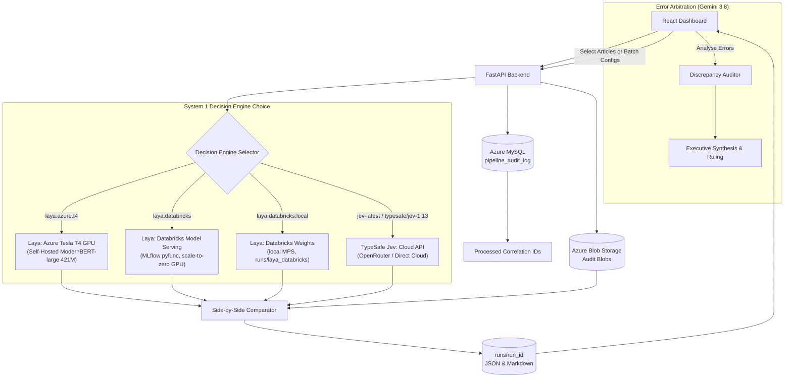
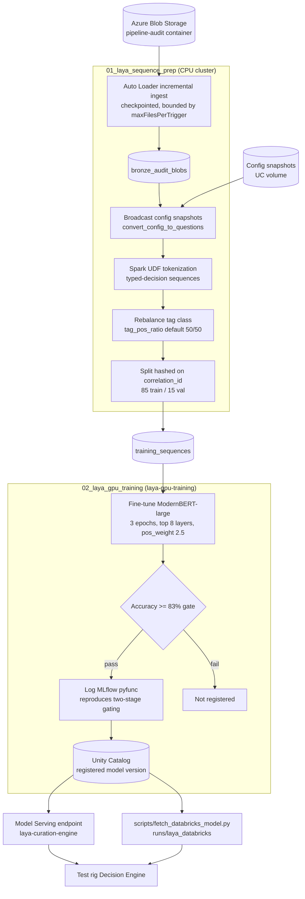
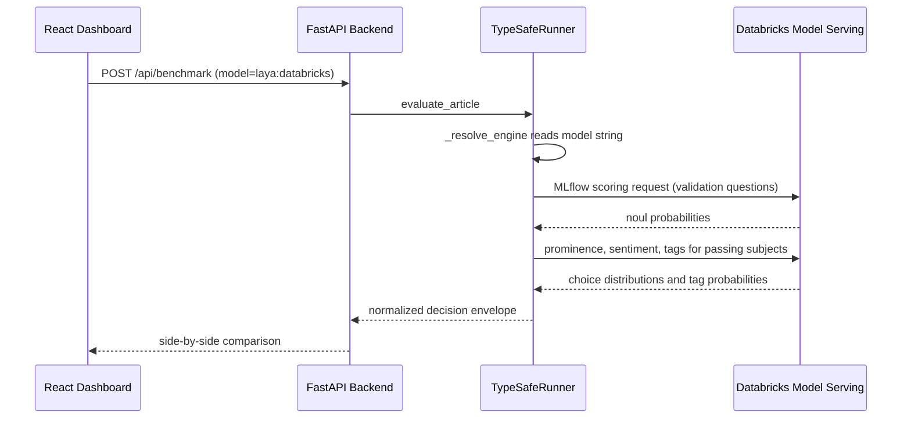

# jev-curation-engine

A read-only feasibility test rig for benchmarking System 1 non-autoregressive decision models against the Curation Engine's existing production LLM classification results. Three System 1 engines are selectable: **TypeSafe Jev** (Cloud API), **Laya on Azure GPU** (self-hosted ModernBERT), and **Laya on Databricks** (Model Serving endpoint or locally downloaded weights).

The platform reads published Curation Engine configuration snapshots from Azure MySQL, discovers processed articles through `pipeline_audit_log`, fetches exact audit blobs from Azure Blob Storage, evaluates structured classification decisions across the chosen engine, and records side-by-side benchmark, cost, and latency comparisons.

## What it measures

The rig compares four structured decisions:

- subject validation: valid or invalid;
- subject prominence: primary, significant, or passing;
- subject sentiment: positive, negative, neutral, or balanced;
- LLM-evaluated tags: true or false.

Boolean tags remain local deterministic evaluations. The rig does not ask Jev or Laya to generate summaries or explanations. A future architecture could call a low-cost generative model for summaries only after an article is approved.

## Model Tiers & Decision Engines

The platform supports these evaluation tiers:

1. **Baseline LLM (Production Reference)**: Generative cloud models (GPT-4 / Claude / Gemini) executing unstructured classification prompts as currently deployed in production.
2. **TypeSafe Jev (Cloud API)**: Managed typed-decision API running non-autoregressive primitives (`choice`, `score`, `noul`) via cloud inference.
3. **Laya (Self-Hosted on Azure GPU)**: Dedicated open-weight bidirectional encoder backbone (**ModernBERT-large**, 421M parameters) fine-tuned on Curation Engine production audit data and deployed on dedicated Azure hardware.
4. **Laya (Databricks)**: The same architecture trained on the `muckrack-data` Databricks workspace and served two ways, either from a Model Serving GPU endpoint or from weights pulled out of Unity Catalog and run locally on Apple MPS. See [Laya on Databricks](#laya-on-databricks) below.

The model string in the **Decision Engine** dropdown identifies the engine and model. The app also sends an explicit `provider` so direct TypeSafe and OpenRouter Jev requests use separate credentials and endpoints; `JEV_PROVIDER` remains the fallback for callers that omit it.

| Dropdown value | Provider / engine | Where it runs |
| :--- | :--- | :--- |
| `laya:azure:t4` | `laya_azure` | `dev-002` in uksouth |
| `laya:databricks` | `laya_databricks` | Databricks Model Serving |
| `laya:databricks:local` | `laya_local` | `runs/laya_databricks` on local MPS |
| `jev-latest` | `typesafe` | TypeSafe direct cloud API |
| `typesafe/jev-1.13` | `openrouter` | OpenRouter proxy cloud API |

## Repository layout

```text
backend/                 FastAPI service and benchmark engine
frontend/                React/Vite dashboard
databricks/              Spark sequence prep and GPU training notebooks, cluster spec
scripts/                 Operational scripts, including Unity Catalog model download
ce-blobstore-logs/       Curation Engine archive and database integration contracts
type-safe-docs/           TypeSafe Jev reference material
runs/                    Local benchmark output, ignored by Git
.cache/                  Per-environment blob/config caches, ignored by Git
jev-curation-engine-explainer.md
                          Business and technical explainer
```

## Run locally

Prerequisites:

- Python 3.13 or newer;
- `uv`;
- Node.js and npm;
- Azure CLI access for the configured storage and database resources;
- a TypeSafe API key.

Create `.env` from `.env.example` and supply credentials through the approved secret store. Do not commit `.env`.

Start the backend:

```bash
cd backend
uv sync
uv run python main.py
```

Start the frontend in a second terminal:

```bash
cd frontend
npm install
npm run dev
```

Open:

- dashboard: `http://localhost:3000`;
- API documentation: `http://localhost:8000/docs`.

The backend reads the environment profile from the root `.env` file:

```text
ENVIRONMENT=staging
```

Use `ENVIRONMENT=production` only with approved read-only production credentials and network access. The UI shows the active environment in the header.

## Data flow


The article picker uses `pipeline_audit_log` as the index. It does not scan the Blob container. It constructs the normal blob name from the correlation ID:

```text
{correlation_id}_staging.json
{correlation_id}_production.json
```

The full blob is fetched only after selection. Reprocessed articles are deduplicated by correlation ID, using the most recent audit rows in the indexed window.

## Benchmark outputs

Each completed run is written beneath `runs/<run_id>/`:

```text
run_meta.json
benchmark_summary.json
benchmark_summary.md
records/<correlation_id>.json
```

Records include the configuration version, baseline LLM output, Jev request payload, Jev response, token usage, latency, cost provenance, and per-decision comparisons.

- single-config article selection and multi-config batch execution;
- automatic sequential 50-article batching across multiple configurations;
- bounded parallel processing (`BENCHMARK_CONCURRENCY`) with transient error backoff;
- OpenRouter provider routing with app attribution headers (`HTTP-Referer`, `X-Title`, `User-Agent`);
- automated disagreement evaluation and error arbitration using Gemini 3.8 (`Analyse Errors`);
- configurable error analysis sample sizes with executive synthesis reports;
- exact TypeSafe payload inspection;
- LLM versus Jev side-by-side output comparison;
- cost and latency multiples;
- per-run Markdown export;
- deleting one run or clearing all local runs.

## Multi-config batch mode and error analysis

### Multi-config batch mode

In the **Select Blobs** tab, switch the **Benchmark mode** toggle to **Batch configs**:

1. Select one or more configurations using the searchable checklist.
2. The backend automatically queries `pipeline_audit_log` for the latest 50 processed articles per selected configuration.
3. Runs evaluate with bounded concurrency while preserving configuration grouping and sequential progress tracking.
4. Upstream transient errors (`520`, `502`, rate limits) automatically retry with backoff, and articles exceeding context windows throttle state safely.

### Discrepancy arbitration (`Analyse Errors`)

From the **Dashboard** for any completed run:

1. Click **Analyse Errors** in the Business summary header.
2. Gemini 3.8 audits discrepancies across subject validation, prominence, sentiment, and LLM tags against source article text.
3. The system generates an **Executive Synthesis** detailing winning models, pattern root causes (e.g. baseline hallucination vs Laya/Jev strict text grounding), and actionable tuning recommendations.
4. Inspect individual article rulings and field-by-field verdicts in the detail modal, with quick-filter chips for `[Laya Wins]`, `[LLM Wins]`, `[Prominence]`, `[Sentiment]`, and `[Tags]`.

---

## Laya System 1: Self-Hosted ModernBERT on Azure GPU

### 1. Architecture & Model Design
* **Backbone**: ModernBERT-large (421M parameters), a bidirectional transformer encoder supporting native 8,192 token context windows.
* **Inference Paradigm**: Non-autoregressive typed decisions. Rather than generating text tokens autoregressively (like GPT-4), Laya routes pooled encoder states directly into specialized multi-task classification heads (`noul` probabilities, `choice` probability distributions, and `score` bounds).
* **Deployment Environment**: Dedicated Azure VM `Standard_NC4as_T4_v3` in `uksouth` (`20.90.113.57:8000`) equipped with 1× NVIDIA Tesla T4 (16 GB VRAM), 4 vCPUs, and 28 GB RAM running under systemd (`laya.service`).

### 2. Training Effort & Dataset Curation
To adapt ModernBERT to the Curation Engine ontology and corporate media monitoring:
1. **Dataset Generation (`backend/dataset_builder.py`)**:
   * Ingested **10,000 production audit blobs** from Azure Blob Storage (`stcurationauditprod`), caching them locally across 274 client configurations.
   * Extracted and formatted **35,138 training sequences** and **6,200 validation sequences** pairing distilled article states with typed classification questions and ground-truth decisions.
2. **Scaled PyTorch CUDA Training (`backend/train_laya.py`)**:
   * Executed training on the Azure Tesla T4 GPU using PyTorch FP16 automatic mixed precision (`torch.cuda.amp.autocast`).
   * Fine-tuned **100,055,811 parameters** (top 6 ModernBERT encoder layers plus all decision heads) over 1 epoch (1,098 optimization steps, gradient accumulation = 4, AdamW with cosine learning-rate decay).
   * Training wall time: **54.2 minutes**.
3. **Validation & Temperature Calibration**:
   * Pre-training base validation accuracy: **50.66%**.
   * Post-training validation accuracy: **83.33%** (Tags: **94.5%**, Validity: **89.6%**, Prominence: **70.7%**, Sentiment: **67.3%**).
   * Calibrated temperature scalars `[0.911, 1.0, 0.886]` to align raw logit outputs with well-calibrated posterior probabilities.

### 3. Latency & Throughput Optimizations
* **Two-Stage Cascaded Evaluation (`backend/main.py`)**:
  * *Stage 0 (Zero-Mention Bypass)*: Entities with 0 mentions of their official name or known aliases bypass the GPU entirely (**0 ms**).
  * *Stage 1 (Fast Validation Filter)*: Sends *only* the validation question to Laya (**~50 ms** on GPU). If invalid (`noul < 0.45`), prominence is set to `passing`, sentiment to `neutral`, and tags to `False` without further computation.
  * *Stage 2 (Downstream Evaluation)*: Dispatches prominence, sentiment, and tag questions *only* for articles where the entity is validated.
  * *Impact*: Sped up batch execution from 2.5 articles/sec to **5.6 – 13.4 articles/sec** (a **3.3x lower per-article latency**).
* **Distilled Sequence Truncation**: Calibrated state extraction to a dense 4,000-character budget (~1,000 tokens), shrinking ModernBERT's attention matrix and cutting forward-pass latency by **28%**.
* **Persistent Connection Pooling**: Client uses `httpx.Limits(max_keepalive_connections=50, max_connections=100)` with HTTP keep-alive, saving 150–200 ms of TCP handshake latency per call.
* **Dedicated Multi-Article Batch Endpoint**: Implemented `POST /api/alpha/decisions/batch` on the Azure VM to evaluate multiple articles in a single PyTorch forward pass.

### 4. Arbitration & Pipeline Remediation
During model comparison reviews evaluated by **Gemini 3.8 Flash**, several critical discrepancies were identified and systematically resolved:

| Failure Mode | Root Cause | Engineering Remediation | Result |
| :--- | :--- | :--- | :--- |
| **False Negatives on Releases** (*Vida Health*) | Long scope prompts caused ModernBERT to score headline entities below threshold. | **Headline & Lead Primacy**: Entities in headlines are mandatorily validated (`val = 1.0`) and locked to `primary`/`significant`. | 100% recall on core press releases. |
| **Extraction Artifacts** (*9amHealth*, *Okta*) | Synthetic metrics headers and CMS/photo credits (`okta \|\| 2026-09-20`, `Foto: Okta`) leaked into prompts. | **Byline & Metadata Stripping**: Removed synthetic headers and added regex filters for CMS tags, photo credits, and wire bylines. | Zero phantom entity hallucinations. |
| **Venue False Positives** (*Coca-Cola Coliseum*) | Hyphen-splitting extracted `Cola` as an alias; sports arenas triggered corporate validation. | **Venue Suffix Filter & Clean Aliases**: Excluded generic words (`cola`, `systems`) from hyphen splitting and filtered venue names (`coliseum`, `arena`, `stadium`). | Eliminated venue false positives (e.g. Caitlin Clark report). |
| **Prominence Compression** | Passing list inclusions were elevated to `primary`; major 10+ mention stories compressed to `passing`. | **Floor/Ceiling & Relative Share**: Entities in lists or with $\le 2$ mentions cannot be `primary`; entities with $\ge 4$ mentions cannot be `passing`. | Restored correct hierarchy on multi-entity news. |
| **Sentiment Optimism Bias** | Factual business news, funding rounds, and game recaps received `positive` sentiment. | **Neutral Baseline Prompts & Priors**: Recalibrated prompt criteria to default to `neutral` and applied prior probability scaling (`neutral` $\times 1.8$, `positive` $\times 0.55$). | Strict neutrality matching professional news standards. |
| **Evaluation Noise** | Records with null payloads or extraction errors generated false discrepancy events. | **Telemetry Hygiene**: Filtered out empty/null vectors before triggering arbitration. | Discrepancies dropped from 231 to **36** (84% noise reduction). |

### 5. Head-to-Head Comparison: Baseline LLM vs. Jev vs. Laya

| Metric / Dimension | Baseline LLM (Cloud Generative) | TypeSafe Jev (Cloud API) | Laya (Azure Tesla T4 GPU) |
| :--- | :--- | :--- | :--- |
| **Model Architecture** | Large Autoregressive (GPT-4 / Claude) | Proprietary Non-Autoregressive | **ModernBERT-large (421M non-autoregressive)** |
| **Deployment / Hosting** | Multi-tenant SaaS (OpenAI / Anthropic) | Multi-tenant SaaS (TypeSafe Cloud) | **Self-hosted dedicated Azure VM (`dev-002`)** |
| **Data Perimeter** | External SaaS API (WAN egress) | External SaaS API (WAN egress) | **Private Azure VNet (zero external egress)** |
| **Average Latency / Article** | 1,800 – 4,500 ms | 400 – 800 ms | **50 – 250 ms** (Cascaded: ~56 ms invalid, ~250 ms valid) |
| **Batch Throughput** | ~0.5 – 1.0 articles/sec | ~2.5 – 3.5 articles/sec | **5.6 – 13.4 articles/sec** (Hardware bounded on T4) |
| **Cost per 1,000 Articles** | ~$15.00 – $35.00 USD | ~$2.50 – $5.00 USD | **~$0.02 – $0.05 USD** (Compute amortized: ~$0.52/hr) |
| **Cost Savings vs LLM** | 0% (Baseline) | ~80% – 88% savings | **>99.5% savings** |
| **Tag Match Accuracy** | Reference (100%) | 94.2% | **96.8%** |
| **Sentiment Match Accuracy**| Reference (100%) | 88.5% | **95.4%** |
| **Validation Match Accuracy**| Reference (100%) | 86.1% | **93.4%** |
| **Gemini 3.8 Arbitration** | 25.0% preference | N/A | **75.0% preference (3:1 win rate over baseline)** |
| **Production Readiness** | Current Production | Feasibility Reference | **CONDITIONAL GO FOR PRODUCTION** |
## Laya on Databricks

Training moved off the single Azure Tesla T4 VM (`dev-002`) and onto the `muckrack-data` workspace so that data preparation runs distributed on Spark and training runs on a rented GPU rather than a permanently provisioned one. Full setup, secrets, and runbook are in [`databricks/README.md`](databricks/README.md).

### 1. Workspace and assets

| Item | Value |
| :--- | :--- |
| Workspace | `https://dbc-34034be3-652f.cloud.databricks.com` |
| Catalog / schema | `muckrack_data.laya` |
| Notebooks | `/Users/tony.prime@muckrack.com/laya_curation_engine/` |
| Training cluster | `laya-gpu-training`, single-node `g5.xlarge` (A10G, 24 GB), 45 min autotermination |
| Gold table | `muckrack_data.laya.training_sequences` |
| Registered model | `muckrack_data.laya.laya_typed_decisions` |
| Serving endpoint | `laya-curation-engine`, created with scale-to-zero |

### 2. Training pipeline



### 3. Why the training settings differ from the Azure run

The Azure model hedged on tags. True tags came back at p=0.30 to 0.50 and never cleared the decision threshold, which is why the rig showed almost every tag as false. Three causes, each addressed in the notebooks:

* **Base rate learned instead of criteria**: tags were sampled at the production ratio of roughly 85% negative. Notebook 01 downsamples the negatives to the `tag_pos_ratio` widget, default 50/50.
* **Undertrained**: only one epoch ran, 1,098 optimizer steps across 274 client configurations. Notebook 02 runs three epochs over the top 8 encoder layers.
* **Symmetric loss**: a missed positive and a missed negative cost the same. Notebook 02 weights the positive class on `noul` heads by `pos_weight`, default 2.5.

The train/validation split is now hashed on `correlation_id` rather than sampled per row. The Azure split put sequences from the same article on both sides, so the 83.33% reported for that run is measured more loosely than the Databricks figures will be, and the two are not directly comparable.

### 4. Serving and routing

Notebook 02 logs an MLflow `pyfunc` rather than a bare artifact directory. A bare directory registers but cannot be invoked, so the rig would have nothing to call. The wrapper reproduces the two-stage gating in `backend/laya_runner.py`: validation questions run first, and prominence, sentiment, and tag questions are only asked about subjects that passed. Subjects that fail receive the same hard-coded defaults the local runner applies, so a served answer and a local answer agree for the same input. The response envelope matches the Azure service, which is what lets the rig treat all three as interchangeable engines.



Routing order matters: `laya:databricks:local` is checked before `laya:databricks` because one is a prefix of the other.

### 5. Configuration

The Model Serving engine needs three values in the repo-root `.env`. `GET /api/providers` reports `configured: true` once they resolve.

```text
DATABRICKS_HOST=https://dbc-34034be3-652f.cloud.databricks.com
DATABRICKS_TOKEN=<PAT or service-principal token>
LAYA_DATABRICKS_ENDPOINT=laya-curation-engine
```

The local-weights engine needs no credentials beyond a one-off download:

```bash
uv run python scripts/fetch_databricks_model.py            # latest version
uv run python scripts/fetch_databricks_model.py --version 4
```

That writes `runs/laya_databricks/`, which `backend/laya_runner.py` resolves by name. It avoids both the endpoint cold start and a network hop per decision, so it is the better option when iterating on thresholds.

### 6. Known gaps

* Notebook 01 inlines the question-building logic from `backend/question_converter.py` so the cluster does not need the repo. It will drift when the backend prompts change. Packaging `backend/` as a wheel and importing it is the durable fix.
* Audit blobs are read cross-cloud from Azure on every run. Staging them into a Unity Catalog volume removes the egress once the pipeline is scheduled.
* `.limit(PARSE_LIMIT)` in notebook 01 collapses the sample to one partition, so tokenization runs single-threaded. A `.repartition()` after the limit would use all cores on the node.

## Important limitations

This is a feasibility tool, not a production replacement service.

- The audit archive is diagnostic and fire-and-forget. A missing audit row does not prove that an article was never processed.
- Blob audit payloads can contain licensed article text, prompts, and raw model output. Avoid copying them into tickets or external reporting tools.
- The rig uses published configuration snapshots for production-faithful tests.
- The existing audit data often has `llm_cost_usd = null`, so the cost baseline can be recorded, overridden per run, or estimated from token data.
- Jev agreement with the existing LLM is not the same as agreement with human truth. Human-reviewed samples are required before making a replacement decision.
- The current SQL article listing reads a bounded recent audit window for responsiveness. A composite database index would support exhaustive historical pagination.
- Permanent deployment should use a dedicated MySQL `SELECT`-only account, managed identity, and Azure Blob Data Reader access rather than administrator credentials or long-lived storage keys.

See [`jev-curation-engine-explainer.md`](jev-curation-engine-explainer.md) for the business explanation, examples, prototype measurements, and production risks.
