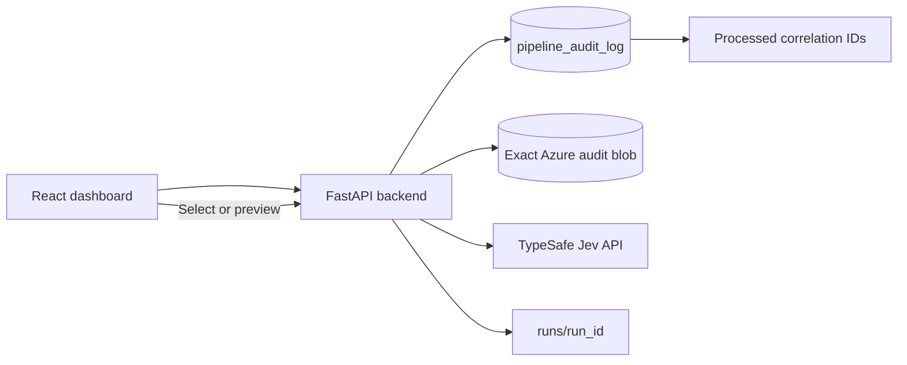

# TypeSafe Curation Engine prototype

A small, read-only feasibility test rig for comparing TypeSafe Jev with the Curation Engine's existing LLM classification results.

The prototype reads published Curation Engine configuration snapshots from Azure MySQL, discovers processed articles through `pipeline_audit_log`, fetches exact audit blobs from Azure Blob Storage, evaluates the structured classification decisions with Jev, and records side-by-side benchmark results.

## What it measures

The rig compares four structured decisions:

- subject validation: valid or invalid;
- subject prominence: primary, significant, or passing;
- subject sentiment: positive, negative, neutral, or balanced;
- LLM-evaluated tags: true or false.

Boolean tags remain local deterministic evaluations. The rig does not ask Jev to generate summaries or explanations. A future architecture could call a low-cost generative model for summaries only after an article is approved.

## Repository layout

```text
backend/                 FastAPI service and benchmark engine
frontend/                React/Vite dashboard
ce-blobstore-logs/       Curation Engine archive and database integration contracts
type-safe-docs/           TypeSafe Jev reference material
runs/                    Local benchmark output, ignored by Git
.cache/                  Per-environment blob/config caches, ignored by Git
jev-curation-engine-explainer.md
                          Business and technical explainer
```

## Run locally

Prerequisites:

- Python 3.13 or newer;
- `uv`;
- Node.js and npm;
- Azure CLI access for the configured storage and database resources;
- a TypeSafe API key.

Create `.env` from `.env.example` and supply credentials through the approved secret store. Do not commit `.env`.

Start the backend:

```bash
cd backend
uv sync
uv run python main.py
```

Start the frontend in a second terminal:

```bash
cd frontend
npm install
npm run dev
```

Open:

- dashboard: `http://localhost:3000`;
- API documentation: `http://localhost:8000/docs`.

The backend reads the environment profile from the root `.env` file:

```text
ENVIRONMENT=staging
```

Use `ENVIRONMENT=production` only with approved read-only production credentials and network access. The UI shows the active environment in the header.

## Data flow



The article picker uses `pipeline_audit_log` as the index. It does not scan the Blob container. It constructs the normal blob name from the correlation ID:

```text
{correlation_id}_staging.json
{correlation_id}_production.json
```

The full blob is fetched only after selection. Reprocessed articles are deduplicated by correlation ID, using the most recent audit rows in the indexed window.

## Benchmark outputs

Each completed run is written beneath `runs/<run_id>/`:

```text
run_meta.json
benchmark_summary.json
benchmark_summary.md
records/<correlation_id>.json
```

Records include the configuration version, baseline LLM output, Jev request payload, Jev response, token usage, latency, cost provenance, and per-decision comparisons.

The dashboard also supports:

- config-filtered article selection;
- exact TypeSafe payload inspection;
- LLM versus Jev side-by-side output comparison;
- cost and latency multiples;
- per-run Markdown export;
- deleting one run or clearing all local runs.

## Important limitations

This is a feasibility tool, not a production replacement service.

- The audit archive is diagnostic and fire-and-forget. A missing audit row does not prove that an article was never processed.
- Blob audit payloads can contain licensed article text, prompts, and raw model output. Avoid copying them into tickets or external reporting tools.
- The rig uses published configuration snapshots for production-faithful tests.
- The existing audit data often has `llm_cost_usd = null`, so the cost baseline can be recorded, overridden per run, or estimated from token data.
- Jev agreement with the existing LLM is not the same as agreement with human truth. Human-reviewed samples are required before making a replacement decision.
- The current SQL article listing reads a bounded recent audit window for responsiveness. A composite database index would support exhaustive historical pagination.
- Permanent deployment should use a dedicated MySQL `SELECT`-only account, managed identity, and Azure Blob Data Reader access rather than administrator credentials or long-lived storage keys.

See [`jev-curation-engine-explainer.md`](jev-curation-engine-explainer.md) for the business explanation, examples, prototype measurements, and production risks.
