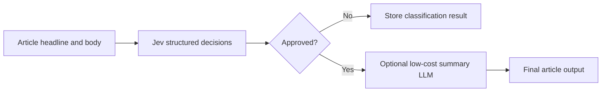
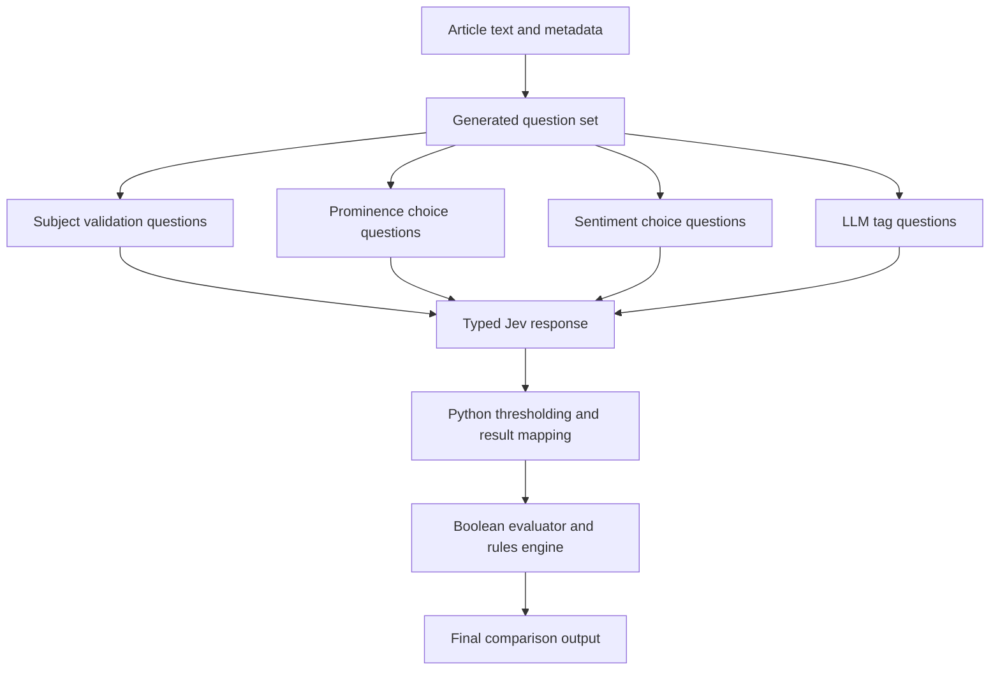
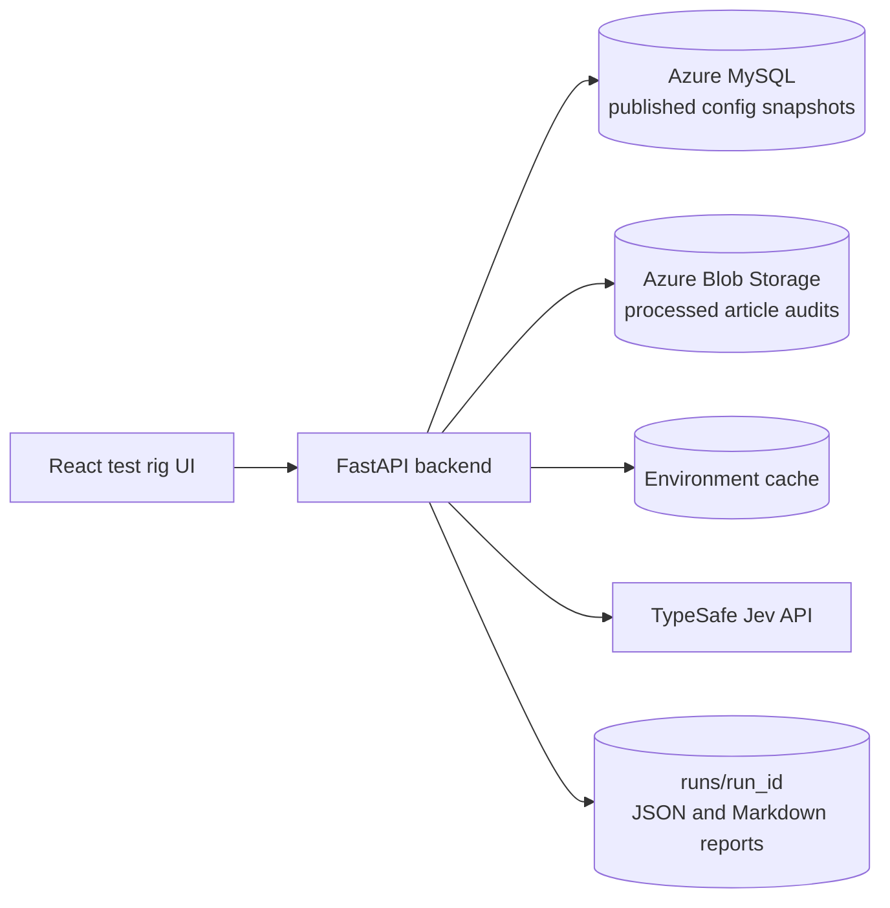
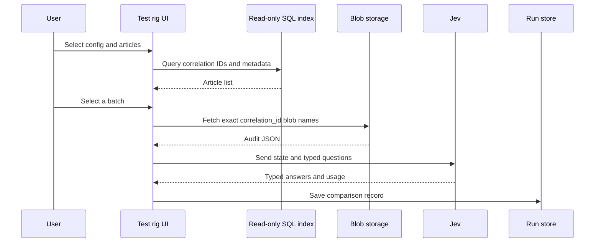
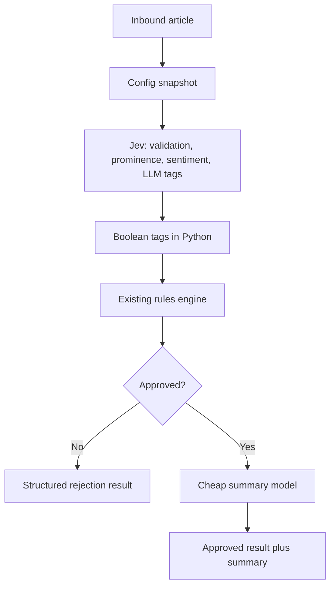

# TypeSafe Jev feasibility prototype for Curation Engine

## Purpose

This document explains what the prototype does, why TypeSafe Jev is a close fit for the structured part of Curation Engine classification, what the early measurements show, and what would need to happen before using the approach in a production decision.

The prototype is a test rig, not a replacement service. It compares Jev decisions with the decisions already captured in Curation Engine audit blobs.

The video referenced in the request was not included as a URL or file, so this document does not make claims based on that video. The TypeSafe claims below come from the supplied TypeSafe documentation and the measurements taken from the prototype.

## The short version

Curation Engine is mostly a text classification pipeline with a small generative part.

For each article and each configured subject, the pipeline makes finite decisions:

- Is the subject valid for this article? `yes` or `no`
- How prominent is the subject? `primary`, `significant`, or `passing`
- What is the sentiment toward the subject? `positive`, `negative`, `neutral`, or `balanced`
- Do configured LLM tags apply? `yes` or `no`

The pipeline also evaluates boolean tags locally and applies deterministic rules after the model response.

The part that genuinely needs free-form generation is the summary, plus explanatory rejection or reasoning text where those fields are enabled. That creates a possible split:



Jev is a strong fit for the first stage because it accepts raw text as state and evaluates typed questions directly. In this use case it behaves much like a zero-shot classifier, except that the output is not one category. It is a set of typed decisions with probabilities and confidence values.

## What the existing Curation Engine does

The production-faithful Curation Engine prompt is assembled from a published configuration snapshot. The snapshot contains subjects, subject criteria, effective tag definitions, summary instructions, and ordered rules.

The traditional classifier receives:

1. A system prompt containing the curation role, media policy, validation rules, subject definitions, subject prompts, summary instructions, rejection instructions, and LLM tag criteria.
2. A user message containing the media type, headline, and full article body.
3. A structured output schema requiring the model to return the expected fields.

Boolean tags do not go to the LLM. They are evaluated locally against:

```text
headline + " " + body
```

The rules engine then applies configured actions such as:

- adding or removing tags;
- overriding sentiment;
- overriding prominence;
- approving or rejecting a subject.

The audit blob stores both raw and final information. The final comparison should use `subject_results` and final grouped tags, not only the raw model response.

## Why this is a natural Jev workload

Jev is designed for software-consumed decisions rather than free-form prose. Its primitives map directly to the four decisions that matter here:

| Curation Engine decision | Jev primitive | Output used by the rig |
|---|---|---|
| Subject validation | `noul` | Probability converted to `true` or `false` using a configurable threshold |
| Subject prominence | `choice` | `primary`, `significant`, or `passing`, plus probabilities and confidence |
| Subject sentiment | `choice` | `positive`, `negative`, `neutral`, or `balanced`, plus probabilities and confidence |
| LLM tag | `noul` | Probability converted to `true` or `false` using a configurable threshold |
| Boolean tag | Local deterministic evaluator | Existing expression result, never sent to Jev |
| Summary | Separate generative LLM | Optional, after approval |

The important architectural difference is that Jev does not need to produce JSON-shaped prose that the application later parses. The questions are typed at the point of evaluation.

All subject and tag questions can be sent in one request. Jev reads the state once and evaluates the questions in parallel. The application then composes the result in normal Python code.



## Example: what the traditional LLM receives

The following is a simplified example. It uses synthetic article content rather than licensed production text.

### System prompt shape

```text
You are a content curation assistant.

Evaluate the provided item against the subjects below.

## Media type
Treat the item as a written article unless the user message identifies it as a radio or television clip.

## Rules
Set validation_result=false when the article is unrelated to all subjects.
Return one subject evaluation for every configured subject.
Use the required values for prominence and sentiment.

## Subjects
### Subject: 106 - Example Motors
Definition: Example Motors is an automotive company...
Validation: Decide whether the article is meaningfully about Example Motors.
Sentiment: Classify the tone toward Example Motors.
Prominence: Classify how prominently Example Motors features.

## Tag Evaluations
### Tag: tag-123 - Electric vehicles
Criteria: Evaluate whether the article discusses the company's electric vehicle programme.
```

### User message shape

```text
## Article

This is a written article.

Headline: Example Motors announces a new electric vehicle plant

Body:
Example Motors announced a new electric vehicle plant and described the investment as part of its manufacturing strategy...
```

### Traditional LLM output shape

```json
{
  "validation_result": true,
  "rejection_reason": null,
  "summary": "Example Motors announced a new electric vehicle plant.",
  "subject_evaluations": [
    {
      "subject_id": "106",
      "is_valid": true,
      "prominence_score": "primary",
      "sentiment_label": "positive",
      "invalid_reason": null,
      "sentiment_reasoning": "The article reports a positive investment announcement."
    }
  ],
  "tag_evaluations": [
    {
      "tag_id": "tag-123",
      "result": true
    }
  ]
}
```

The response is useful, but the summary and reasoning fields make the call more generative than the four business decisions require.

## Example: what Jev receives

Jev receives a state and a set of independent typed questions. There is no request to generate a summary or explain the decision.

```json
{
  "model": "jev-latest",
  "state": {
    "media_type": "article",
    "headline": "Example Motors announces a new electric vehicle plant",
    "body": "Example Motors announced a new electric vehicle plant and described the investment as part of its manufacturing strategy..."
  },
  "questions": {
    "subject_106_valid": {
      "type": "noul",
      "instructions": "Is the provided content meaningfully relevant to Example Motors?",
      "criteria": {
        "true": "The article is substantively about Example Motors under the configured subject definition and validation criteria.",
        "false": "The article is unrelated or contains only a passing mention of Example Motors."
      }
    },
    "subject_106_prominence": {
      "type": "choice",
      "instructions": "What is the prominence of Example Motors in this content?",
      "criteria": {
        "primary": "The main focus of the article is Example Motors.",
        "significant": "Example Motors is a substantial topic but not the sole main focus.",
        "passing": "Example Motors receives only a minor or incidental mention."
      }
    },
    "subject_106_sentiment": {
      "type": "choice",
      "instructions": "What is the sentiment toward Example Motors?",
      "criteria": {
        "positive": "The coverage is favorable or reports a positive development.",
        "negative": "The coverage is adverse, critical, or reports a negative development.",
        "neutral": "The coverage is factual without a clear positive or negative tone.",
        "balanced": "The coverage contains substantial positive and negative elements."
      }
    },
    "tag_106_tag-123": {
      "type": "noul",
      "instructions": "Does this content match the Electric vehicles tag criteria?",
      "criteria": {
        "true": "The article discusses the company's electric vehicle programme.",
        "false": "The article does not match the Electric vehicles criteria."
      }
    }
  }
}
```

A representative Jev response is structured around the question IDs:

```json
{
  "model": "jev-1.13.0",
  "answers": {
    "subject_106_valid": {
      "type": "noul",
      "noul": 0.98
    },
    "subject_106_prominence": {
      "type": "choice",
      "choice": "primary",
      "probabilities": {
        "primary": 0.97,
        "significant": 0.03,
        "passing": 0.0
      },
      "confidence": 0.96
    },
    "subject_106_sentiment": {
      "type": "choice",
      "choice": "positive",
      "probabilities": {
        "positive": 0.91,
        "negative": 0.01,
        "neutral": 0.06,
        "balanced": 0.02
      },
      "confidence": 0.87
    },
    "tag_106_tag-123": {
      "type": "noul",
      "noul": 0.95
    }
  },
  "usage": {
    "input_tokens": 420,
    "output_tokens": 35
  }
}
```

The prototype maps the `noul` probability to a Boolean result. The current default threshold is `0.50`, but the threshold is recorded per run and should be calibrated rather than treated as a permanent truth.

## The business-domain alignment

The fit is not based on forcing a general-purpose model to write a carefully formatted paragraph. It comes from the shape of the domain:

```text
Article text + configuration criteria
        ↓
Finite decisions for each subject and tag
        ↓
Deterministic business rules
        ↓
Optional prose summary
```

For a single subject, Curation Engine does not need an open-ended answer to decide whether to include the article. It needs a small record such as:

```json
{
  "subject_id": "106",
  "is_valid": true,
  "prominence": "significant",
  "sentiment": "balanced",
  "llm_tags": {
    "tag-123": true,
    "tag-456": false
  }
}
```

This is classification with multiple dimensions. Jev's atomic questions match those dimensions directly.

The remaining deterministic parts should stay in code:

- thresholding probabilities;
- calculating aggregate metrics;
- evaluating Boolean expressions;
- applying rules;
- choosing whether to call a summary model;
- calculating cost and latency.

That separation is important. Jev should not be asked to do arithmetic or to reproduce the rules engine in natural language.

## Early prototype measurements

The figures below are prototype observations, not production guarantees. The baseline blobs do not populate `llm_cost_usd`, so the rig currently uses a configurable baseline of `$0.007` per article. Jev cost uses the documented `$0.042` per million input tokens and free output tokens.

### Five-article F1 run

| Measure | Existing LLM | Jev | Comparison |
|---|---:|---:|---:|
| Average model-stage latency | 6,084.5 ms | 966.85 ms | 6.29x faster |
| Total estimated cost | $0.035000 | $0.000974 | 35.9x lower Jev cost |
| Cost reduction percentage | | | 97.2% |

The percentage and the multiple answer different questions:

```text
Cost reduction percentage = (LLM cost - Jev cost) / LLM cost × 100
Cost multiple = LLM cost / Jev cost
```

For example, if the LLM costs `$0.672000` and Jev costs `$0.044853`:

```text
Percentage reduction = (0.672000 - 0.044853) / 0.672000 = 93.3%
Cost multiple        = 0.672000 / 0.044853 = 15.0x
```

For business communication, the prototype now leads with the multiple. Saying that the LLM cost is 15.0x the Jev cost is clearer than presenting 93.3% on its own.

### Why the early numbers need care

The archived blobs contain input and output token counts, but their recorded cost is often null. Those token counts may not include all provider-billed thinking or hidden usage. A flat `$0.007` baseline is therefore a practical comparison control, not a billing ledger.

The rig records the cost source on each result:

- `recorded_in_blob` when Curation Engine provides a cost;
- `request_override` when a user supplies a run-specific baseline;
- `flat_override` when the configured `$0.007` default is used;
- `token_estimate` when the rig calculates from token counts and configured rates.

A production comparison should use a provider billing export or a reliable per-call cost field whenever possible.

## Prototype architecture



The current prototype has these components:

| Component | Responsibility |
|---|---|
| React frontend | Select configs and blobs, start runs, show metrics, inspect payloads, compare outputs |
| FastAPI backend | Orchestrate config loading, blob access, Jev calls, comparisons, and reports |
| Config manager | Load published configuration snapshots from MySQL and cache them |
| Blob manager | Download audit blobs and maintain a per-environment local index/cache |
| Question converter | Turn subject and effective tag definitions into Jev questions |
| Jev runner | Send one typed request containing all subject and LLM tag questions |
| Comparator | Compare Jev answers with archived final Curation Engine results |
| Run logger | Write per-article records and business-ready Markdown summaries |

Each benchmark record stores the configuration version, Jev request, Jev response, baseline output, timing, token usage, cost source, and comparison results. That makes a result inspectable rather than just a number on a dashboard.

## Proposed production test flow

The current blob refresh scans Azure and is slow at production volume because normal audit blob names are correlation IDs, not config IDs. The next improvement is to use an application or database index of processed articles:



This avoids scanning and downloading unrelated production blobs. It also gives the picker useful metadata before the user selects an article.

## Where Jev could sit in a future Curation Engine

A possible split is:

1. Resolve the published configuration snapshot.
2. Send the article state and typed subject/tag questions to Jev.
3. Evaluate Boolean tags locally.
4. Apply the existing rules engine.
5. Decide whether the article is approved.
6. Call a low-cost generative model for a summary only when the article is approved.
7. Store the structured decisions and optional summary.



This could reduce the number of expensive generative calls. It would not remove the need for ordinary application code or for a generative model if the business still requires a natural-language summary.

## Risks and open questions

### Model and decision quality

The prototype measures agreement with the existing LLM output. That is useful for feasibility, but it is not the same as measuring truth. If the existing model is wrong, agreement can reproduce the same error.

The next evaluation should include:

- a human-reviewed sample;
- disagreement review by subject and label;
- separate thresholds for validation and tags if the data supports them;
- confidence buckets;
- confusion matrices for prominence and sentiment;
- tests for prompt injection in article text;
- checks that rules and subject-specific tag overrides remain production-faithful.

Jev's documented weaknesses also matter. It should not be used for exact arithmetic, date comparison, or unnecessary multi-hop reasoning. The rig should keep those operations in Python.

### Summary quality

The structured decision stage can be replaced independently from the summary stage, but the summary still needs evaluation. Calling a summary model only after approval lowers cost, but it can also mean that rejected articles have less diagnostic context. That is acceptable only if the business does not need summaries or explanations for rejected items.

### Vendor lock-in

Jev is currently a hosted service with a specific API, model family, pricing model, and output semantics. A production integration would create dependency on:

- the TypeSafe endpoint and SDK contract;
- Jev's calibration and label behavior;
- service availability and rate limits;
- pricing that may currently be subsidized or introductory;
- US hosting and data residency terms;
- enterprise retention and contractual controls;
- a provider-specific question format.

The service is worth watching because the problem shape is general. Other vendors may offer similar typed decision models. The application should keep a provider-neutral internal interface such as:

```python
class StructuredClassifier:
    async def classify(
        self,
        state: dict,
        questions: dict,
    ) -> StructuredDecision:
        ...
```

That keeps the Curation Engine mapping, thresholding, rule application, and reporting independent from one provider.

### Security and access

The prototype is read-only with respect to the production database and blob archive, but the credentials still need production treatment:

- use a dedicated MySQL `SELECT`-only account instead of the pipeline administrator;
- use Microsoft Entra authentication and `Storage Blob Data Reader` where possible;
- avoid long-lived storage account keys in `.env` for a permanent deployment;
- use managed identity and private networking for a hosted production rig;
- never send credentials, full audit blobs, or unnecessary prompt content to a reporting LLM;
- avoid logging full licensed article bodies or raw prompts outside controlled storage.

### Operational cost and throughput

Jev's documented limits are high for a small test rig, but a production migration still needs:

- bounded concurrency;
- retry handling for transient failures and HTTP 429 responses;
- idempotent run records;
- request and response retention rules;
- cost controls and a maximum batch size;
- a way to resume an interrupted run;
- monitoring for provider latency and error rates.

## What the prototype proves, and what it does not

The prototype proves that it is technically possible to:

- read published Curation Engine configuration snapshots;
- convert the relevant criteria into typed Jev questions;
- evaluate all subjects and LLM tags in one Jev request;
- compare Jev decisions with archived Curation Engine results;
- record timing, usage, cost, raw payloads, and per-decision differences;
- inspect LLM and Jev outputs side by side;
- run the same test rig against staging and production data sources.

It does not yet prove that Jev can replace the production classifier. The evidence needed for that decision is a larger, human-reviewed, configuration-stratified benchmark with reliable cost data and a clear fallback plan.

## Recommended next step

Use the production SQL article index to build a representative benchmark rather than scanning the blob container. Sample articles across:

- high-volume and low-volume configurations;
- one-subject and many-subject configurations;
- articles with and without LLM tags;
- radio and television clips;
- accepted and rejected outcomes;
- rules-heavy configurations;
- languages and media types used in production.

Then report three separate results:

1. agreement with the existing Curation Engine output;
2. agreement with human-reviewed labels;
3. cost and latency under the actual proposed operating model.

That will give the business a more useful answer than a single overall accuracy number: where Jev is already a credible replacement, where it needs calibration, and where the existing LLM should remain in the loop.
